# Aurum Supply House — Entity Relationship Diagram

Immutability note: dashed relationships from `invoices`/`invoice_items`/`commissions` to upstream
records are *snapshot* links — the invoice copies the data at creation and does not depend on the
live row afterward. Solid lines are live foreign keys.

```mermaid
erDiagram
    profiles ||--o{ clients : "assigned_rep"
    profiles ||--o{ invoices : "sales_rep"
    profiles ||--o{ commissions : "recipient"

    pricing_sheets ||--o{ pricing_sheet_items : contains
    pricing_sheet_items ||--o{ pricing_tiers : "qty breaks"
    pricing_sheets ||--o{ clients : "default model"
    pricing_sheet_items ||--o{ pricing_item_history : journals
    clients ||--o{ client_price_overrides : "SKU overrides"
    products ||--o{ client_price_overrides : overridden_in

    manufacturers ||--o{ products : supplies
    products ||--o{ product_cost_history : "cost over time"
    products ||--o{ pricing_sheet_items : priced_in
    catalog_import_batches ||--o{ product_cost_history : sourced

    manufacturers ||--o{ purchase_orders : from
    purchase_orders ||--o{ purchase_order_items : contains
    purchase_orders ||--o{ purchase_order_attachments : has
    purchase_orders ||--o{ purchase_order_status_history : tracks
    purchase_orders ||--o{ manufacturer_payments : "paid via"
    products ||--o{ purchase_order_items : ordered

    clients ||--o{ invoices : billed
    invoices ||--o{ invoice_items : contains
    invoices ||--o{ payments : receives
    invoices ||--o{ commissions : splits
    invoices ||--o{ order_expenses : incurs
    invoices ||--o{ invoice_status_history : tracks
    products }o..o{ invoice_items : "snapshot ref"

    profiles ||--o{ activity_log : actor

    profiles {
        uuid id PK "= auth.users.id"
        text full_name
        text email
        user_role role
        profile_status status
        numeric default_commission_rate
    }
    clients {
        uuid id PK
        text company_name
        uuid assigned_rep_id FK
        uuid default_pricing_sheet_id FK
        payment_terms payment_terms
        client_status status
        uuid portal_user_id "reserved"
    }
    manufacturers {
        uuid id PK
        text name
        int default_lead_time_days
    }
    products {
        uuid id PK
        text sku UK
        text name
        uuid manufacturer_id FK
        numeric current_true_cost "cached"
        int moq
        product_status status
    }
    product_cost_history {
        uuid id PK
        uuid product_id FK
        numeric true_cost
        date effective_date
        cost_source source
    }
    pricing_sheets {
        uuid id PK
        text name
        bool is_default
        sheet_status status
    }
    pricing_sheet_items {
        uuid id PK
        uuid pricing_sheet_id FK
        uuid product_id FK
        numeric selling_price
    }
    pricing_tiers {
        uuid id PK
        uuid pricing_sheet_item_id FK
        int min_qty
        int max_qty
        numeric unit_price
    }
    purchase_orders {
        uuid id PK
        text po_number UK
        uuid manufacturer_id FK
        po_status status
        numeric total
        numeric deposit_amount
        numeric amount_paid
        numeric balance_due
    }
    manufacturer_payments {
        uuid id PK
        uuid purchase_order_id FK
        manufacturer_payment_type type
        numeric amount
        date payment_date
        payment_method method
        text reference
    }
    client_price_overrides {
        uuid id PK
        uuid client_id FK
        uuid product_id FK
        numeric selling_price
    }
    order_expenses {
        uuid id PK
        uuid invoice_id FK
        order_expense_type type
        numeric amount
        date incurred_on
    }
    purchase_order_items {
        uuid id PK
        uuid purchase_order_id FK
        uuid product_id FK
        int quantity
        numeric unit_cost
        numeric line_total
    }
    invoices {
        uuid id PK
        text invoice_number UK
        uuid client_id FK
        jsonb client_snapshot
        uuid sales_rep_id FK
        uuid pricing_sheet_id FK
        invoice_status status
        order_stage stage "reserved"
        numeric subtotal
        numeric shipping "customer-paid"
        numeric total
        numeric total_true_cost
        numeric gross_profit
        numeric total_commission
        numeric total_expenses
        numeric net_profit
        numeric amount_paid
        numeric balance_due
    }
    invoice_items {
        uuid id PK
        uuid invoice_id FK
        uuid product_id FK "nullable snap"
        text sku "snapshot"
        int quantity
        numeric unit_price
        numeric unit_true_cost
        numeric line_gross_profit
        text lot_number "optional"
        date expiration_date "optional"
    }
    payments {
        uuid id PK
        uuid invoice_id FK
        numeric amount
        payment_method method
        timestamptz received_at
    }
    commissions {
        uuid id PK
        uuid invoice_id FK
        commission_recipient_type recipient_type
        uuid recipient_id FK "null if external"
        text recipient_name
        text recipient_email "external"
        commission_type commission_type
        numeric rate
        numeric basis_amount
        numeric amount
        commission_status status
    }
    activity_log {
        uuid id PK
        uuid actor_id FK
        text entity_type
        uuid entity_id
        text action
    }
    app_settings {
        bool id PK "singleton"
        text company_name
        text invoice_prefix
        numeric default_tax_rate
    }
```

